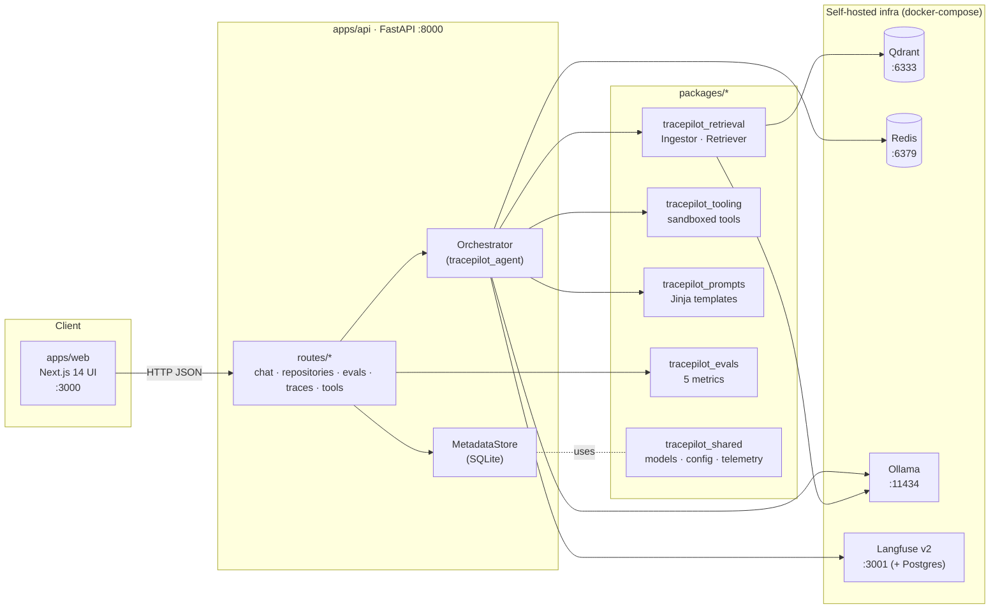

# TracePilot

**Open-source AI engineering copilot for grounded code intelligence and safe
developer workflows.**

TracePilot is a self-hosted assistant that answers questions about *your* codebase
with citations, helps engineers onboard, investigates bugs, and reviews changes —
all grounded in retrieved evidence and backed by a fully observable agent graph.
Every model call, retrieval, and tool run is traced; every answer is scored. It
runs entirely on your own infrastructure with local models (Ollama), a local
vector store (Qdrant), and self-hosted observability (Langfuse).

> Built for teams who want LLM-assisted engineering **without** shipping their
> source code to a third-party API.

---

## Why TracePilot

- **Grounded, not hallucinated.** Answers cite exact `file:line` evidence pulled
  from a hybrid (dense + BM25) retriever. No citation, no claim.
- **Local-first.** Models run on Ollama; embeddings run in-process via `fastembed`
  (no model pull needed) or via Ollama. Nothing leaves your machine.
- **Fully observable.** A LangGraph agent graph emits a span per node into both a
  built-in Redis trace store and Langfuse, so you can see exactly how every answer
  was produced.
- **Safe by construction.** Tools run in a sandbox: workspace allowlist, path
  containment, a command denylist, timeouts, and output truncation. No destructive
  operations are possible. See [`docs/security.md`](docs/security.md).
- **Evaluated continuously.** Five metrics (grounding, relevance, completeness,
  tool success, retrieval quality) score answers online and offline; scores land
  in Langfuse. See [`docs/evaluations.md`](docs/evaluations.md).

---

## Features

| Capability | What it does |
|---|---|
| **Ask** | Grounded Q&A over one or more repositories, with `[n]` citations. |
| **Onboard** | "Explain this codebase / subsystem" with an architecture-first answer. |
| **Debug** | Structured root-cause analysis from a bug report + stack trace, with a fix plan. |
| **Change review** | Impact + risk review of a unified diff (computed via `git diff` if not supplied). |
| **Fix plan** | Concrete, sequenced remediation steps with risks and a test strategy. |
| **Sandboxed tools** | `repo_search`, `read_file`, `dep_tree`, `run_tests`, `run_lint`, `git_diff`, `static_analysis` — all read-only and confined. |
| **Hybrid retrieval** | Dense (Qdrant) + sparse (BM25) fusion, language-aware chunking, optional cross-encoder rerank. |
| **Tracing & evals** | Per-node Langfuse spans + a built-in trace viewer; online + offline scoring. |

---

## Architecture



A deeper component + sequence view lives in
[`docs/architecture.md`](docs/architecture.md).

---

## Quickstart (local, Docker)

You need **Docker** + **Docker Compose**. Models run on CPU by default (GPU is
optional).

```bash
# 1. Get the code
git clone https://github.com/jintukumardas/trace-pilot.git
cd trace-pilot

# 2. Configure
cp .env.example .env

# 3. Boot the full stack (api, web, qdrant, redis, ollama, langfuse)
make up

# 4. Pull the default local models into the Ollama container (one-time, ~minutes)
make pull-models

# 5. Seed the bundled demo repository and run a sample grounded query
make seed

# 6. Open the UI
open http://localhost:3000      # or just visit it in your browser
```

`make seed` connects `scripts/demo_repo` (a tiny "ledger" service), indexes it,
and prints a grounded answer with citations — proving the whole pipeline end to
end. From there, head to **http://localhost:3000/chat** to ask your own questions,
or **http://localhost:3000/ingestion** to connect a real repository.

> First run is the slow one: `make pull-models` downloads the Ollama models and
> the first chat/index downloads the `fastembed` embedding model. Subsequent runs
> are fast.

For a native (non-Docker) workflow, see
[`docs/local-development.md`](docs/local-development.md).

---

## Services & ports

| Service | URL | Purpose |
|---|---|---|
| Web UI | http://localhost:3000 | Next.js dashboard (workspaces, ingestion, chat, evals, settings) |
| API | http://localhost:8000 · [docs](http://localhost:8000/docs) | FastAPI backend (OpenAPI at `/docs`) |
| Qdrant | http://localhost:6333/dashboard | Vector store + dashboard |
| Langfuse | http://localhost:3001 | Tracing & evals UI (`admin@tracepilot.local` / `tracepilot123`) |
| Ollama | http://localhost:11434 | Local model serving |
| Redis | `localhost:6379` | Trace + job state cache (no UI) |

---

## Model configuration (env)

Everything is configured via environment variables (see
[`.env.example`](.env.example)). The most common knobs:

| Variable | Default | Notes |
|---|---|---|
| `OLLAMA_BASE_URL` | `http://ollama:11434` | Point at host Ollama with `http://host.docker.internal:11434`. |
| `OLLAMA_GEN_MODEL` | `llama3.1:8b` | Answer-writing ("gen") model. |
| `OLLAMA_REASONING_MODEL` | `qwen2.5-coder:7b` | Planning/judging ("reason") model. |
| `EMBEDDING_PROVIDER` | `fastembed` | `fastembed` (in-process, no pull) or `ollama`. |
| `EMBEDDING_MODEL` | `BAAI/bge-small-en-v1.5` | fastembed model (dim **384**). |
| `EMBEDDING_DIM` | `384` | Must match the model. For `nomic-embed-text` via Ollama, use **768**. |
| `RETRIEVAL_TOP_K` | `8` | Default candidates per query. |
| `HYBRID_ALPHA` | `0.6` | Dense vs. sparse fusion weight (0 = all sparse, 1 = all dense). |
| `RERANK_ENABLED` | `false` | Enable the cross-encoder reranker (`fastembed TextCrossEncoder`). |
| `MAX_CONTEXT_CHARS` | `16000` | Budget for the packed evidence block. |
| `TOOL_TIMEOUT_SECONDS` | `30` | Per-tool wall-clock limit. |
| `LANGFUSE_ENABLED` | `true` | Set `false` to run with the built-in Redis trace store only. |

To switch to **Ollama embeddings**:

```env
EMBEDDING_PROVIDER=ollama
OLLAMA_EMBED_MODEL=nomic-embed-text
EMBEDDING_DIM=768
```

> Changing the embedding model/dim changes the vector space — re-index your
> repositories (full, not incremental) after switching.

---

## How a query flows through the agent graph

A `POST /chat/query` runs through an 8-node LangGraph graph. Each node opens a
Langfuse span:

```
router → retrieval_planner → retriever → code_analyst → action_planner
                                                            │
                 ┌── needs_tools & iterations < 2 ──────────┤
                 ▼                                          ▼
          tool_executor ──► code_analyst (loop)        synthesizer
                                                            │
                                                          judge → END
```

1. **router** — classify intent (`question`/`onboarding`/`debugging`/…). The UI
   mode is a strong prior so debug/review can't be downgraded.
2. **retrieval_planner** — decompose the request into focused vector queries
   (scoped to the requested repositories/branch).
3. **retriever** — run hybrid retrieval, merge/dedupe evidence, build the `[n]`
   citations and a budget-bounded context block. *No LLM call.*
4. **code_analyst** — free-text reasoning over the evidence (and tool results on
   later passes). Feeds the planner and synthesizer.
5. **action_planner** — decide whether sandboxed tools are needed and which.
   Requires a resolvable repo on disk; refuses to plan once the tool budget is spent.
6. **tool_executor** — run planned tools in the sandbox, accumulate results, loop
   back to `code_analyst` (bounded to **2** iterations).
7. **synthesizer** — write the final, grounded answer + `next_actions` (or the
   structured debug/review product for those modes).
8. **judge** — score grounding/relevance/completeness and push to the trace.

Everything **fails soft**: a model or tool failure becomes a warning and a
grounded fallback, never a 500. Full detail (state object, routing, how to add a
node) is in [`docs/agent-graph.md`](docs/agent-graph.md).

---

## Repository layout

```
trace-smith/
├── apps/
│   ├── api/        FastAPI backend (routes, services, SQLite MetadataStore)
│   └── web/        Next.js 14 App Router UI (dashboard, chat, evals, settings)
├── packages/
│   ├── shared/     Pydantic models, config, logging, telemetry, ids  (frozen)
│   ├── prompts/    Jinja2 prompt templates + loader
│   ├── retrieval/  ingestion, chunking, embeddings, Qdrant store, retriever, citations
│   ├── tooling/    sandboxed developer tools + the sandbox primitives
│   ├── agent-graph/ LangGraph orchestrator, nodes, state, runtime
│   └── evals/      online + offline evaluation (5 metrics) + default dataset
├── scripts/
│   ├── seed_demo.py    end-to-end demo seeder (httpx against the running API)
│   └── demo_repo/      the bundled sample project that seed_demo ingests
├── infra/docker/   api + web Dockerfiles
├── docs/           architecture, agent-graph, retrieval, evaluations, security, dev
├── docker-compose.yml
├── Makefile        task runner (`make help`)
└── .env.example
```

The authoritative public interface of every package is documented in
[`docs/INTERNAL_CONTRACTS.md`](docs/INTERNAL_CONTRACTS.md).

---

## Troubleshooting

| Symptom | Likely cause / fix |
|---|---|
| `make seed` says the API never became healthy | The stack isn't up. Run `make up`, wait for containers, then retry. Check `make logs`. |
| Chat answers but has **no citations** | The repo isn't indexed, or Qdrant is down. Re-index via `/ingestion`; check `http://localhost:6333/dashboard`. |
| Answers say "the local model is unavailable" | Ollama isn't reachable or the model isn't pulled. Run `make pull-models`; verify `OLLAMA_BASE_URL`. |
| Indexing hangs at a low percentage on first run | The `fastembed` model is downloading. Give it a few minutes; watch `make logs`. |
| Traces don't appear in Langfuse | Langfuse keys must match `docker-compose.yml`'s `LANGFUSE_INIT_*`. The built-in `/traces` view still works without Langfuse. |
| Switched embedding model, retrieval is empty/garbled | Vector dim changed. Re-index repositories **fully** (`incremental: false`). |
| Docker API can't see a local repo path | Mount it: set `HOST_REPOS_DIR` and connect by the in-container path (`/repos/...`), or set `DEMO_REPO_PATH=/repos/demo_repo` for the seeder. |

---

## Non-goals

- **Not a cloud SaaS.** TracePilot is self-hosted; there is no hosted multi-tenant
  service, billing, or SSO.
- **Not an autonomous code-writing agent.** It explains, investigates, and reviews;
  it never edits, commits, or pushes code. All tools are strictly read-only.
- **Not a general web agent.** Tools cannot reach the network (no `curl`/`wget`);
  grounding comes only from indexed repositories.
- **Not a replacement for code review or tests.** Its output is advisory and is
  meant to be verified by an engineer.
- **Not tuned for frontier-model quality.** It targets small, local models; answer
  quality scales with the models you run.

---

## License

MIT — see [`LICENSE`](LICENSE). Copyright (c) 2026 Jintu Kumar Das.
