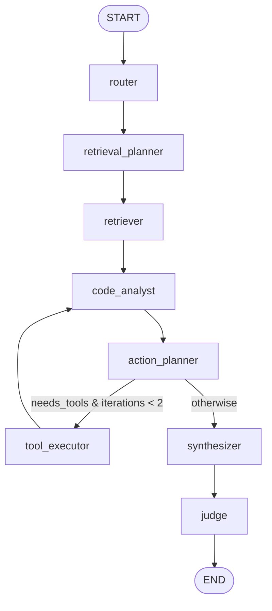

# Agent graph

The agent is a compiled **LangGraph** `StateGraph` of eight nodes. The
`Orchestrator` (`tracepilot_agent.runtime`) builds an `AgentState`, invokes the
cached graph, and maps the terminal state into the right response model
(`ChatResponse` / `DebugResponse` / `DiffReviewResponse`). The same graph serves
all five modes — `ask`, `onboard`, `debug`, `change_review`, `fix_plan` — with the
synthesizer dispatching to a mode-specific template.

Source: `packages/agent-graph/tracepilot_agent/` (`graph.py`, `state.py`,
`runtime.py`, `nodes/*`).

---

## The graph



- **Linear spine:** `router → retrieval_planner → retriever → code_analyst →
  action_planner`.
- **Conditional edge** out of `action_planner` (`_route_after_action`): loop into
  `tool_executor` *only* while `needs_tools` is set, `tool_calls` is non-empty, and
  `iterations < MAX_TOOL_ITERATIONS` (2); otherwise go straight to `synthesizer`.
- **Tool loop:** `tool_executor → code_analyst → action_planner` re-analyzes with
  the new tool results before deciding again.
- **Tail:** `synthesizer → judge → END`.

The compiled graph is cached process-wide (`get_compiled_graph`, `lru_cache`). It
is stateless: every per-request handle (tracer, retriever, repo locator, settings)
rides on `AgentState`, so one compiled instance is shared safely across requests.
The orchestrator invokes it with `recursion_limit=40` (generous headroom over the
bounded path).

---

## The eight nodes

Each node is a pure `(AgentState) -> dict` function that opens a `tracer.span`,
renders its prompt via `tracepilot_prompts.render`, calls the local model through
`tracepilot_agent.models.complete`, and returns a **partial** state update for
LangGraph to merge. **Nodes never raise** — every model/tool failure becomes a
`warnings` entry plus a grounded fallback.

| # | Node | Model role | JSON? | Produces | Fallback when model is down |
|---|---|---|---|---|---|
| 1 | `router` | reason | yes | `intent`, `repository_focus` | Use the UI mode as the intent prior. |
| 2 | `retrieval_planner` | reason | yes | `queries`, `plan` | One hybrid query over the raw request. |
| 3 | `retriever` | — (no LLM) | — | `evidence`, `citations`, `context` | Fewer/empty results, per-query fail-soft. |
| 4 | `code_analyst` | reason | no (free text) | `analysis` | A short factual note ("model offline"). |
| 5 | `action_planner` | reason | yes | `needs_tools`, `tool_calls` | `needs_tools=False` (skip tools). |
| 6 | `tool_executor` | — (sandbox) | — | `tool_results`, `iterations++` | Skip calls if no workspace path. |
| 7 | `synthesizer` | gen / reason | yes | `answer`, `confidence`, `next_actions`, `debug`/`review` | Evidence-only answer listing cited files. |
| 8 | `judge` | reason | yes | `scores` (+ trace scores) | Heuristic grounding/completeness estimate. |

Node notes:

- **router** — classifies into `IntentType`. Debug/change_review UI modes are
  explicit user choices and are *not* downgraded to `question` on a thin
  classification.
- **retrieval_planner** — caps at 4 queries; forces the request's
  `repository_ids` / `branch` onto every filter so the model can't widen scope.
- **retriever** — runs each planned query through `Retriever.retrieve(query,
  tracer)`, merges + dedupes evidence (best score per chunk, capped at 12), then
  builds `Citation`s and the packed context from the *same* ordered list so `[n]`
  markers align.
- **code_analyst** — the only free-text node; runs after every tool loop so the
  second pass folds in tool results.
- **action_planner** — caps at 3 tool calls, only honors real `ToolName`s, and
  requires a resolvable repo on disk; refuses to plan tools once the budget is
  spent.
- **tool_executor** — resolves the repo via `RepoLocator`, builds a
  workspace-confined `ToolContext`, runs each `ToolCall` through
  `tracepilot_tooling.execute_tool`, accumulates results (cap 6), increments
  `iterations`, and clears `tool_calls`.
- **synthesizer** — dispatches on mode: `debug` → `debug_synthesizer`,
  `change_review` → `change_review`, else `synthesizer`. Mirrors a readable
  summary into `answer` for debug/review so the judge has text to score.
- **judge** — advisory only; writes scores via `tracer.score(...)` (mirrored to
  Langfuse) and never overwrites the answer.

---

## The state object — `AgentState`

A `TypedDict` (`total=False`) so nodes can return partial updates and the
non-serializable runtime handles ride along untouched. Grouped fields:

```text
# request envelope
request, mode, history, repository_ids, workspace_id, branch,
stack_trace, reproduction, diff, title, repository_id

# per-node products
intent, repository_focus, plan, queries, evidence, citations, context,
analysis, needs_tools, tool_calls, tool_results

# answer envelope
answer, confidence, next_actions, debug{}, review{}, scores{}

# bookkeeping
iterations, warnings, errors

# injected runtime handles (never serialized into telemetry)
tracer, settings, retriever, repo_locator
```

`make_initial_state(...)` seeds every product field to a safe empty default and
injects the runtime dependencies, so nodes can append without guarding for missing
keys and the terminal-state → response mapping always finds well-typed defaults.
For single-repo flows (review) the `repository_id` is also folded into
`repository_ids` so retrieval is scoped the same way tool resolution is.

---

## Routing & the bounded tool loop

The tool loop is bounded to **two iterations** by *three independent guards* —
defense in depth against a model that tries to spin forever:

1. **The conditional edge** (`_route_after_action`) only returns `"tool_executor"`
   while `needs_tools` is true, `tool_calls` is non-empty, and `iterations < 2`.
2. **`tool_executor`** increments `iterations` and clears `tool_calls` after each
   run, so a stale plan can't re-trigger the loop.
3. **`action_planner`** short-circuits to "no tools" once `iterations >= 2`, and
   also declines to plan tools when the repo isn't resolvable on disk.

The orchestrator additionally caps LangGraph recursion at 40.

---

## Fallback behavior

The contract is **fail soft, never 500**:

- Any node that calls the model checks `is_degraded(...)`/`warn_if_degraded(...)`
  and substitutes a grounded fallback (e.g. the synthesizer returns an
  evidence-only answer that lists the cited `file:line` locations and tells the
  user to restore Ollama).
- The retriever degrades to fewer results when a query fails; an empty index
  yields an empty-but-valid response with a warning.
- A crash *inside* `graph.invoke` is caught in `Orchestrator._run`: it records the
  error on the trace metadata, appends a warning, and returns a degraded-but-valid
  response (low confidence) carrying whatever evidence was gathered.
- All warnings surface on the response's `warnings` list and in the trace, so the
  UI can show partial degradation honestly.

---

## How each node maps to a Langfuse span

Every node wraps its work in `with tracer.span(name, type=..., input=...) as sp:`
and calls `sp.update(output=...)`. The `type` drives how Langfuse renders the span:

| Node | Span name | `type` |
|---|---|---|
| router | `router` | `generation` |
| retrieval_planner | `retrieval_planner` | `generation` |
| retriever | `retriever` (+ nested `retrieve` from the Retriever) | `retrieval` |
| code_analyst | `code_analyst` | `generation` |
| action_planner | `action_planner` | `generation` |
| tool_executor | `tool_executor` (+ a span per tool) | `tool` |
| synthesizer | `synthesizer` / `debug_synthesizer` / `change_review` | `generation` |
| judge | `judge` | `generation` |

The `Tracer` (`tracepilot_shared.telemetry`) records the same tree to Redis (so the
built-in `/traces` UI works without Langfuse) and mirrors it to Langfuse v2 when
configured. `judge` calls `tracer.score(...)` to attach grounding/relevance/
completeness; online `evaluate_chat` later pushes its scores onto the same
`trace_id`.

---

## How to add a node

1. **Write the node** in `packages/agent-graph/tracepilot_agent/nodes/<your_node>.py`
   as a `(AgentState) -> dict` function. Open a `tracer.span`, render a prompt with
   `tracepilot_prompts.render`, call `complete(prompt, role=..., want_json=...,
   settings=state.get("settings"))`, and return a partial update. **Never raise** —
   on a degraded model, append a warning and return a grounded default.

2. **Add any new state fields** to `AgentState` in `state.py` and seed them in
   `make_initial_state(...)`.

3. **Add a prompt template** at
   `packages/prompts/tracepilot_prompts/templates/<name>.jinja` (instruct strict
   JSON if the node parses structured output).

4. **Export the node** from `nodes/__init__.py`.

5. **Wire it** in `graph.py`: `graph.add_node("your_node", your_node)` plus the
   appropriate `add_edge` / `add_conditional_edges`. If it sits inside the tool
   loop, keep the iteration guard intact.

6. **Map outputs** into the response in `runtime.py` if your node introduces new
   response fields, and bump `_RECURSION_LIMIT` only if you genuinely lengthen the
   path.

7. **Trace type** — pick the right span `type` (`generation` for LLM steps,
   `retrieval`, `tool`, or plain `span`) so Langfuse renders it correctly.
