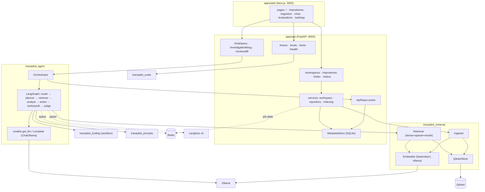
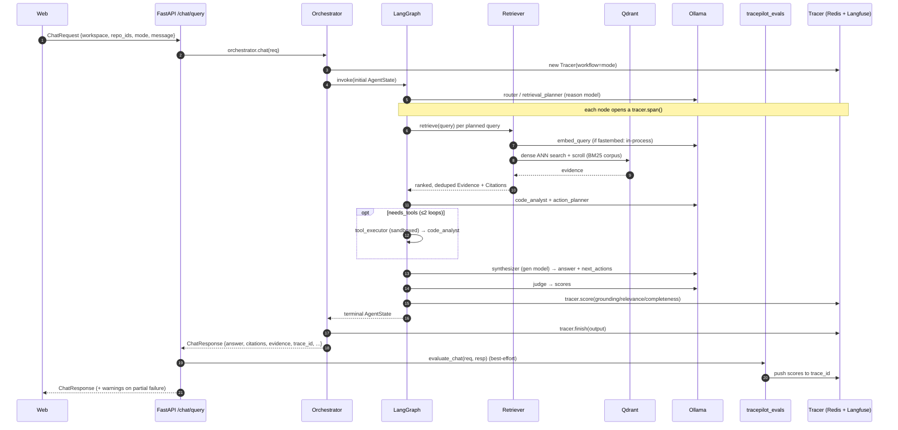

# Architecture

TracePilot is a monorepo split into a thin **API** (`apps/api`), a **web UI**
(`apps/web`), and a set of independent Python **packages** (`packages/*`) that the
API composes at startup. Self-hosted infrastructure (Qdrant, Redis, Ollama,
Langfuse) is provided by `docker-compose.yml`.

This document covers the services and their responsibilities, the request flow for
`/chat/query`, where data and metadata live, and the design decisions behind the
key choices.

---

## Services & responsibilities

| Service | Tech | Responsibility |
|---|---|---|
| **Web** | Next.js 14 (App Router, TS, Tailwind) | Dashboard, ingestion controls, chat (ask/onboard/debug/change_review/fix_plan), evidence & trace drawers, evals, settings. Talks only to the API over JSON. |
| **API** | FastAPI (`tracepilot_api`) | HTTP surface. Owns the `MetadataStore` (SQLite), builds the retrieval/agent/eval singletons at startup, and routes requests into them. |
| **Qdrant** | Qdrant 1.11 | Vector store for code/doc chunks. One collection (`tracepilot_chunks`), cosine distance, keyword payload indexes for filtering. |
| **Redis** | Redis 7 | Cache for live index-job state and the built-in trace store (mirrors Langfuse so the trace UI works even without it). |
| **Ollama** | Ollama | Local model serving for the "gen" (answer) and "reason" (plan/judge) roles, and optionally embeddings. |
| **Langfuse** | Langfuse **v2** + Postgres | Observability: traces (one span per agent node) and evaluation scores. |

### Packages (`packages/*`)

| Package | Public surface | Role |
|---|---|---|
| `tracepilot_shared` | models, `get_settings`, `get_logger`, `Tracer`/telemetry, `new_id` | **Frozen** foundation imported by everything. The single source of truth for data shapes. |
| `tracepilot_prompts` | `render`, `load_prompt`, `available_prompts` | File-backed Jinja2 prompt templates. |
| `tracepilot_retrieval` | `Ingestor`, `Retriever`, `get_embedder`, `get_qdrant_store`, `build_citations`, `pack_context` | Ingestion + hybrid retrieval + citation assembly. |
| `tracepilot_tooling` | `ToolContext`, `execute_tool`, `get_tool_specs`, `get_registry` | Sandboxed, read-only developer tools. |
| `tracepilot_agent` | `Orchestrator`, `build_graph`, `RepoLocator` | The LangGraph agent graph and its orchestration. |
| `tracepilot_evals` | `evaluate_chat`, `run_dataset`, `load_default_dataset` | Online + offline evaluation across five metrics. |
| `tracepilot_api` | `tracepilot_api.main:app` | Wires all of the above behind HTTP. |

Dependency direction is strictly downward: `shared` ← `prompts`/`tooling`/
`retrieval` ← `agent-graph`/`evals` ← `api`. No package imports the API.

---

## Component view

---

## Sequence: `POST /chat/query`

`debug` (`/investigate/debug`) and `review` (`/review/diff`) reuse the **same**
graph with the mode set; the synthesizer swaps in the `debug_synthesizer` /
`change_review` templates and emits the structured `DebugResponse` /
`DiffReviewResponse`.

---

## Data & metadata stores

| Store | What lives there | Lifetime |
|---|---|---|
| **SQLite** (`MetadataStore`) | Workspaces, repositories, index jobs (JSON columns, thread-safe). Source of truth for metadata. | Durable (file under `DATA_DIR`). |
| **Qdrant** | Chunk vectors + payload (text, `file_path`, lines, `chunk_type`, `language`, `symbol`, `commit_hash`, `content_hash`). | Durable (Docker volume). |
| **Redis** | Live index-job progress (cache over SQLite) + the built-in trace tree (7-day TTL, last 500 traces). | Ephemeral cache. |
| **Langfuse / Postgres** | Mirrored traces + evaluation scores for the observability UI. | Durable (Docker volume). |
| **Filesystem** | Connected repo working trees (local paths, or clones under `WORKSPACES_DIR`). | Durable. |

The metadata store and the vector store are intentionally decoupled: deleting a
repository's vectors (`QdrantStore.delete_repository`) does not touch its SQLite
row, and vice versa.

---

## Design decisions

### Why Langfuse **v2** (not v3)
v3 self-hosting requires ClickHouse + Redis + an S3-compatible blob store — heavy
for a "clone and `make up`" experience. Langfuse **v2** self-hosts with only
Postgres, which keeps the local stack to a single extra database. The compose file
seeds an org/project/user and **deterministic** API keys (`LANGFUSE_INIT_*`) so the
API can emit traces on first boot with zero manual setup. The shared
`telemetry.Tracer` is written against the v2 SDK and is guarded so a flaky Langfuse
never breaks a request — and a built-in Redis trace store means the `/traces` UI
works even with Langfuse disabled.

### Why `fastembed` as the default embedder
`fastembed` runs **in-process** with no model server and no `make pull-models`
step for embeddings — the model (`BAAI/bge-small-en-v1.5`, dim 384) downloads on
first use and is cached. This makes the very first index/query work out of the box.
Ollama embeddings (`nomic-embed-text`, dim 768) remain a one-line switch for teams
that prefer to centralize all model serving. The embedder is a small `Protocol`
(`dim`, `name`, `embed_documents`, `embed_query`) so both backends are interchangeable,
and `get_embedder` caches a singleton keyed by `(provider, model, dim)`.

### Why hybrid retrieval (dense + BM25)
Code search needs both semantics ("where do we validate transfers?") and exact
identifier matching (`balance_minor`). Dense vectors handle the former; BM25 over a
scrolled corpus handles the latter, with a code-aware tokenizer that splits
`camelCase`/`snake_case`. Scores are min-max normalized per leg and fused with
`HYBRID_ALPHA`. An optional cross-encoder rerank (`fastembed TextCrossEncoder`) is
lazy and off by default. Details in [`retrieval.md`](retrieval.md).

### Why a LangGraph state machine (not a single prompt)
Separating routing, planning, retrieval, analysis, action, synthesis, and judging
into discrete nodes makes each step independently **traceable**, **testable**, and
**fail-soft**. The bounded tool loop (≤2) and three independent guards prevent
runaway cost. The graph is compiled once and cached; all per-request data
(including the tracer, retriever, and repo locator) rides on `AgentState`, so a
single compiled graph is safely shared across requests. Details in
[`agent-graph.md`](agent-graph.md).

### Why local SQLite for metadata
Metadata is small, relational, and benefits from durability without operating a
database server. The stdlib `sqlite3` driver (with `check_same_thread=False` + a
lock) is enough and keeps the dependency surface tiny. Redis is a pure cache layer
on top for live job progress.

### Why a hard package boundary on `tracepilot_shared`
Every package agrees on data shapes by importing the same frozen Pydantic models.
The web UI mirrors those JSON shapes in `lib/types.ts`. Because `shared` never
imports anything else in the repo, there are no cycles, and the public contracts
in [`INTERNAL_CONTRACTS.md`](INTERNAL_CONTRACTS.md) can be relied on package by
package.

### Why read-only, sandboxed tools
The agent can *investigate* a repository (search, read, run tests/lint, inspect
diffs) but can never mutate it. The sandbox enforces a workspace allowlist, path
containment (defeats `..`, absolute escapes, and symlinks), a binary allowlist + a
destructive-token denylist, timeouts, and output truncation. See
[`security.md`](security.md).
